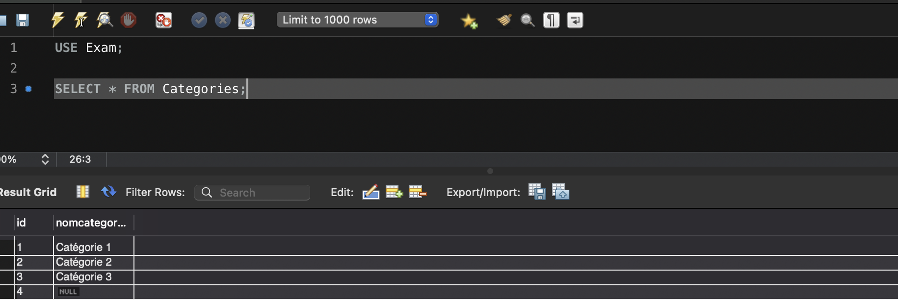

<h1>Explication de l'audit de l'API:</h1>

<h2>Manquements:</h2>
Pas de protection contre les injections SQL :

Donc par exemple perte de cohérence de la base de donnée en cas d'attaque.

Utilisation de la base de donnée à partir d'un compte qui détient tous les pouvoirs:
Ainsi cet utilisateur a aussi accès aux autres bases de données.

Ici la cause est une injection SQL mais l'ajout d'un profil adapté aurait pu empêcher cette faille.

Chaque élément du tableau peut se retrouver incomplet malgré les cardinalités du MCD:

Champs potentiellement négatifs rendant la logique du site incomplète:

Problèmes changés dans la V1 pour éviter les incohérence ou les partage de mes infos :

Utilisation d'un mot de passe en clair (mot de passe du root) pour se connecter à la base de donnée qui est ici déplacé dans le .env qui n'est pas sauvegardé dans le repo.

<h2>Solutions mises en place:</h2>

Création de requêtes préparées (empêchant les injections SQL).

Création d'un utilisateur spécifique à cette base de donnée avec des droits restreints.

Ajout d'un check empêchant le stock de produit d'être négatif.

Ajout de transaction et changement de la logique de commande (lors de la création d'une commande, automatisation de la création des lignes de commandes et rollback en cas de commandes > à la quantité de produit en stock et donc rollback(pas d'incohérence dans les données)):

exemple de json de requête pour post /commandes

{ 
     "datecommande": "2023-10-01",
     "idclient": 1,
     "lignescommandes": [
         {
            "idproduit": 1,
            "quantitecommande": 2,
            "prixunitaire": 10.50
        },
         {
            "idproduit": 2,
            "quantitecommande": 1,
            "prixunitaire": 20.00
        }
     ]
}

Vérification de l'input d'email (la forme de l'email):

<h1>IMPORTANT</h1>
Le .env doit ressembler à ceci:
DB_PASSWORD=azerty
DB_USER_PASSWORD=azerty

Avec DB_PASSWORD contenant le mdp de votre root user personnel de mysql et 
DB_USER_PASSWORD étant le mot de passe que vous voulez.

<h1>Schema</h1>

Manque : 
L'ajout d'une clé OU l'ajout d'une authentification pour utiliser l'API (JWT)
FRONT-END
