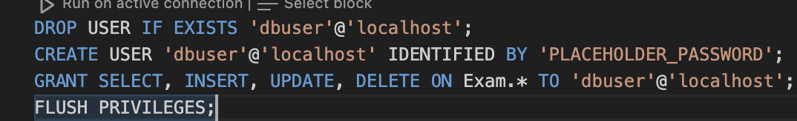

<h1>Explication de l'audit de l'API:</h1>

<h2>Manquements:</h2>
Pas de protection contre les injections SQL :

Donc par exemple perte de cohérence de la base de donnée en cas d'attaque.

Utilisation de la base de donnée à partir d'un compte qui détient tous les pouvoirs:
Ainsi cet utilisateur a aussi accès aux autres bases de données.

Ici la cause est une injection SQL mais l'ajout d'un profil adapté aurait pu empêcher cette faille.

Chaque élément du tableau peut se retrouver incomplet malgré les cardinalités du MCD:

Champs potentiellement négatifs rendant la logique du site incomplète:

Problèmes changés dans la V1 pour éviter les incohérence ou les partage de mes infos :

Utilisation d'un mot de passe en clair (mot de passe du root) pour se connecter à la base de donnée qui est ici déplacé dans le .env qui n'est pas sauvegardé dans le repo.

<h2>Solutions mises en place:</h2>

Création de requêtes préparées (empêchant les injections SQL).

Création d'un utilisateur spécifique à cette base de donnée avec des droits restreints.

Ajout d'un check empêchant le stock de produit d'être négatif et de NOT NULL dans toutes les tables pour rendre les données cohérentes.

Ajout de transaction et changement de la logique de commande (lors de la création d'une commande, automatisation de la création des lignes de commandes et rollback en cas de commandes > à la quantité de produit en stock et donc rollback(pas d'incohérence dans les données)):

exemple de json de requête pour post /commandeauto

{ 
     "datecommande": "2023-10-01",
     "idclient": 1,
     "lignescommandes": [
         {
            "idproduit": 1,
            "quantitecommande": 2,
            "prixunitaire": 10.50
        },
         {
            "idproduit": 2,
            "quantitecommande": 1,
            "prixunitaire": 20.00
        }
     ]
}

Vérification de l'input d'email (la forme de l'email):

<h1>Améliorations demandées</h1>
<h2>Commandes par années (intervales)</h2>

<h2>Commandes par client</h2>

<h2>Commandes par produits</h2>

<h2>Recherche améliorée (à plusieurs facteurs)</h2>

<h2>Classement des plus vendus</h2>

<h2>Stats du total des ventes</h2>

<h2>Commande automatique améliorée (décrémentation, vérifications)</h2>

Je l'avais déjà fait avant d'où sa présence 2 fois dans ce doc

<h2>Notification de stock faible</h2>

<h1>IMPORTANT</h1>
<h2>Le .env</h2>
Le .env doit ressembler à ceci:
 DB_PASSWORD=azerty
 DB_USER_PASSWORD=azerty
<h2>Installation des dépendances</h2>
npm install
<h2>Lancement des applications</h2>
node Script.js

Avec DB_PASSWORD contenant le mdp de votre root user personnel de mysql et 
DB_USER_PASSWORD étant le mot de passe que vous voulez.

<h1>Schema</h1>

<h1>Routes (endpoints par swagger)</h1>
Disponibles sur : http://localhost:3000/api-docs
Il faut d'abord lancer node Script.js sur ExamenV2.

<h2>Manque :</h2> 
 L'ajout d'une clé OU l'ajout d'une authentification pour utiliser l'API (JWT)
 FRONT-END
 Historique des commit (j'ai lu la partie sur l'historique des commit entre V1 et V2 que à la fin et vu que quand j'ai mis ExamenV1 et ExamenV2 qui avaient déjà des repo git dans ExamenBDD ca a fait des submodules innaccessible ducoup j'ai dû les supprimer, il ne reste que les commit d'après la création des routes CRUD sécurisées V2/ou non V1)
 

<h1>Problèmes rencontrés:</h1>
Mysql ne prend pas en compte les delimiters? 
 Réponse de chatgpt:
 ❌ Why DELIMITER Doesn't Work in mysql2?
 DELIMITER is not part of SQL syntax – it's a MySQL CLI command.
 MySQL clients like mysql2 don't need it – they execute queries as-is.
 Stored procedures work without it – Just ensure BEGIN ... END; is used correctly.

